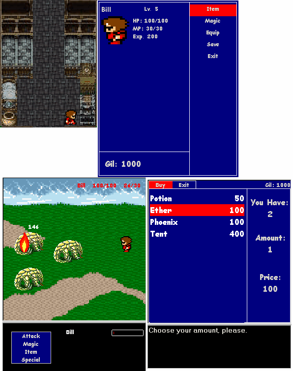



## A FINAL FANTASY CLONE\.\. in progress of course

### Description

Well, I keep updating this game.. mostly because there's nothing left to be done on my winterbreak. working so far: some magic, items, weapons/armor, battles, treasure chests, some story (a bad story mind you), game menus. the tab, space and arrow keys are all you'll need in this game. tab gets you into the game menu and then will cancel you out of menus, use space to select options and talk to people. so give me your criticism, i've decided to take it like the man i am...
 
### More Info
 

             |
---                |---
**Submitted On**   |2004-01-17 19:34:00
**By**             |[john hollister](https://github.com/Planet-Source-Code/PSCIndex/blob/master/ByAuthor/john-hollister.md)
**Level**          |Intermediate
**User Rating**    |4.6 (55 globes from 12 users)
**Compatibility**  |VB 6\.0
**Category**       |[Games](https://github.com/Planet-Source-Code/PSCIndex/blob/master/ByCategory/games__1-38.md)
**World**          |[Visual Basic](https://github.com/Planet-Source-Code/PSCIndex/blob/master/ByWorld/visual-basic.md)
**Archive File**   |[A\_FINAL\_FA1695911172004\.zip](https://github.com/Planet-Source-Code/john-hollister-a-final-fantasy-clone-in-progress-of-course__1-51043/archive/master.zip)

